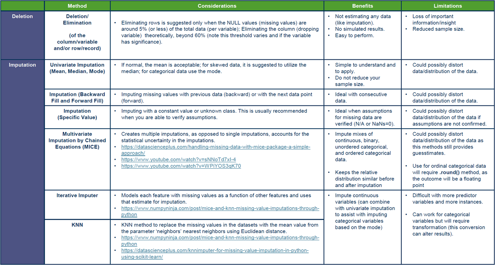
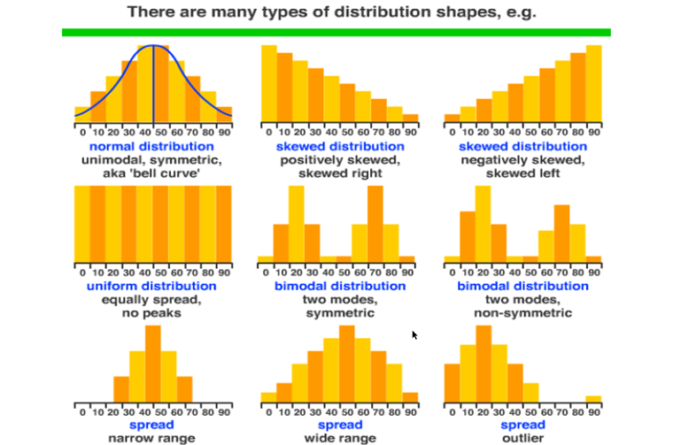
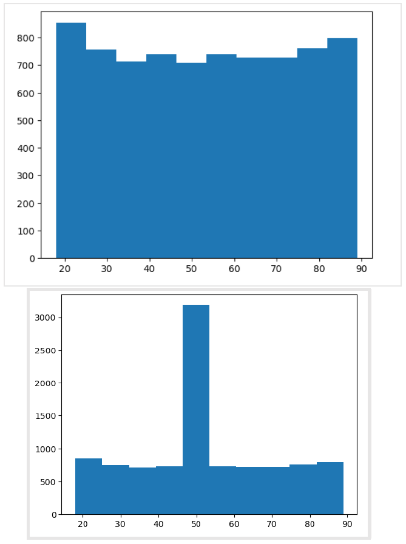

# D206

## Detecting & Treating Duplicates

### Python

* `duplicated()` returns a pandas.Series of booleans indicating if the row is a duplicate. By default, all columns are used to determine if the row is duplicated.
* `value_counts()` can be used to determine the number of duplicate records in the data set (`True` from calling `duplicated`).
* `drop_duplicates` to remove duplicates from the data set. Should duplicates be dropped?

1. `df.info()` to get the layout of the data frame.
1. `df.duplicated()` to find the duplicates.
1. `df.duplicated().value_counts()` will tell you how many many of the records in the data set are duplicates.
1. `df = df.drop_duplicates()` to drop all duplicates.
1. `df.duplicated().value_counts()` verify that the duplicates were removed.

### R

* `.duplicated()` retruns ___ with duplicated rows marked `TRUE`. By default, all columns are used to determine if the row is duplicated.
* `sum(duplicated)` will count the number of duplicated rows.
* `distinct` removes duplicates.

1. `str(df)` examine the structure of the data frame.
1. `duplicated(df)` find duplicates.
1. `sum(duplicated(df))` count the duplicates.
1. `df <- distinct(df)` drop all duplicates.
1. `sum(duplicated(df))` verify that the duplicates were removed.

## Detecting Missing Values

### Python

Missing values are usually represented as `NaN`, `null`, or `None`.

First, we need to detect whether there are any missing values in the data set with `isnull().sum()`.

`isnull().sum()` - `isnull()` detects null values and `sum()` will create a summary of the missing data.

The missing data can also be visualized using the `missingno` module. The sparsity of the data and where the nulls occur can be seen in the visualization.

```python
import missingno as msno
msno.matrix(df, fontsize=12, labels=True)
plt.title("Missing data matrix")
# plt.xlabel(col_names)
plt.show()
```

### R

Again, missing values are usually represented as `NaN`, `null`, or `None`.

Determine where or not there are any missing values with `colSums(is.na(df))`.

You can do visualizations with the `visdat` library. This visualization will also handily provide percentages for missing and non-missing values.

```r
vis_miss(df)
```

### Treating Missing Values

#### Deletion

Sometimes it is safe to remove data with missing values depending on the data sparsity/volume of data that is missing.

* Removing variables - dropping the entire column. Only when over 60% of that variable are missing.
* Removing observations - drop rows with missing values. Suggested only when 5% or less of the total rows have missing values.

Benefits:

* Not estimating any data
* No simulated results
* Easy to perform

Limitations:

* Loss of important information/insights
* Reduced sample size

#### Imputation

Imputation is a technique used for replacing missing data with a reasonable value (guesstimate). Used because deleting data from the data set is not always feasible as it reduces the size of the data set and raises concerns about biasing the data set and incorrect analysis.

* Univariate Statistical Imputation (mean, median, mode)

    Considerations:

    * If normal, the mean is acceptable.
    * For skewed data, it is suggested to utilize the median.
    * For categorical data use the mode.

    Benefits:

    * Simple to understand and apply.
    * Does not reduce sample size.

    Limitations:

    * Could distort data or distribution of the data.

* Imputation (Backward/Forward Fill)

    Considerations:

    * Imputing missing values with previous (backward) or the next data point (forward).

    Benefits:

    * Ideal with consecutive data.

    Limitations:

    * Could distort data or distribution of the data.

* Imputation (Specific Value)

    Considerations:

    * Imputing with a constant value or unknown class.
    * Usually recommended when you are able to verify assumptions.

    Benefits:

    * Ideal when assumptions for missing data are verified.

    Limitations:

    * Could distort data or distribution of the data if assumptions are not verified.

* Multivariate Imputation by Chained Equations (MICE) [usually done for R]

    Considerations:

    * Creates multiple imputations.
    * Accounts for statistical uncertainty in the assumptions.
    * [https://datascienceplus.com/handlinq-missinq-data-with-mice-packaqe-a-simple-approach/](https://datascienceplus.com/handling-missing-data-with-mice-package-a-simple-approach/)
    * [Multiple Imputation by Chained Equations (MICE)](https://youtu.be/zX-pacwVyvU?si=g2Haue4bODFpbq4I)
    * [Multivariate Imputation By Chained Equations (MICE) algorithm for missing values](https://youtu.be/WPiYOS3qK70?si=RrIt-MAc4I-muZyW)
    * [Multiple Imputation by Chained Equations (MICE) clearly explained](https://youtu.be/BjyUbk258o4?si=hpBOj5EEv_N7ik5W)

    Benefits:

    * Impute mixes of continuous, binary, unordered categorical, and ordered categorical data.
    * Keeps the relative distribution similar before and after imputation.

    Limitations:

    * Could distort data or distribution of the data as this method still provides guesstimates.
    * Use for ordinal categorical data will require `.round()` as the outcome will be floating-point.

* Iterative Imputer [usually for Python]

    Considerations:

    * Models each feature with missing values as a function of other features and uses that for imputation.
    * [https://www.numpyninja.com/post/mice-and-knn-missing-value-imputations-through-python](https://www.numpyninja.com/post/mice-and-knn-missing-value-imputations-through-python)

    Benefits:

    * Impute continuous variables (can combine with univariate imputation to assist with imputing categorical variables based on the mode).

    Limitations:

    * Difficult with more predictor variables and more instances.
    * Can work for categorical variables but will require transformation (this conversion can alter results).

* K-Nearest Neighbor (KNN) Imputation

    Considerations:

    * KNN Method to replace the missing values in the data set with the mean value from the parameter 'neighbors' nearest neighbors Euclidean distance.
    * [https://www.numpyninja.com/post/mice-and-knn-missing-value-imputations-through-python](https://www.numpyninja.com/post/mice-and-knn-missing-value-imputations-through-python)
    * [https://datascienceplus.com/knnimputer-for-missing-value-imputation-in-python-using-scikit-learn/](https://datascienceplus.com/knnimputer-for-missing-value-imputation-in-python-using-scikit-learn/)

    Benefits:

    * Impute continuous variables (can combine with univariate imputation to assist with imputing categorical variables based on the mode).

    Limitations:

    * Difficult with more predictor variables and more instances.
    * Can work for categorical variables but will require transformation (this conversion can alter results).




* [https://datascienceplus.com/handlinq-missinq-data-with-mice-packaqe-a-simple-approach/](https://datascienceplus.com/handling-missing-data-with-mice-package-a-simple-approach/)
* [https://www.numpyninja.com/post/mice-and-knn-missing-value-imputations-through-python](https://www.numpyninja.com/post/mice-and-knn-missing-value-imputations-through-python)
* [https://datascienceplus.com/knnimputer-for-missing-value-imputation-in-python-using-scikit-learn/](https://datascienceplus.com/knnimputer-for-missing-value-imputation-in-python-using-scikit-learn/)

## Treating Missing Values using Univariate Imputation

Three steps:

1. Examine the distribution of the variable you are about to impute
    * histogram
    * looking for symmetry or skew to determine which method (mean, median, mode) to use
2. Perform the imputation
    * mean for a normal/uniform distribution
    * median if skewed or bi-modal
    * mode for categorical/nominal variables (character/Boolean)
3. Verification
    * check that the missing values are resolved
    * the new distribution is in relative alignment with the distribution prior to the imputation



### Python

Step 1: Examine current distribution

```python
import matplotlib.pyplot as plt

# %matplotlib inline if in Jupyter

plt.hist(test_data['column_name'])  # generate histogram
```

Step 2: Perform imputation

```python
# Children is positively skewed right
test_data['Children'].fillna(test_data['Children'].median(), inplace=True)

# Age is uniformly distributed
test_data['Age'].fillna(test_data['Age'].mean(), inplace=True)

# Marital is categorical
test_data['Marital'].fillna(test_data['Marital'].mode(), inplace=True)
```

Step 3: Verification

```python
# verify missing values were imputed
test_data.isnull().sum()

# compare pre- and post-histograms for alignment
plt.hist(test_data['column_name'])
```

### R

Step 1: Examine current distribution

```r
library(ggplot2)

test_data %>%
    ggplot(aes(column.name)) %>%
    geom_histogram()
```

Step 2: Perform imputation

```r
# Children is positively skewed right
test_data$Children[is.na(test_data$Children)] <- median(test_data$Children, na.rm=TRUE)

# Age is uniformly distributed
test_data$Age[is.na(test_data$Age)] <- mean(test_data$Age, na.rm=TRUE)

# Marital is categorical (mode)
test_data$Area[is.na(test_data$Area)] <- (names(which.max(table(df$Area))))

# if the categorical variable is numeric you must use the following code as the above will crate a character class variable
test_data$Area[is.na(test_data$Area)] <- as.numeric(names(which.max(table(df$Area))))
```

Step 3: Verification

```r
# verify missing values were imputed
colSums(is.na(test_data))

# compare pre- and post-histograms for alignment
test_data %>%
    ggplot(aes(column.name)) %>%
    geom_histogram()
```

## Another Verification Method

Sometimes after imputation, you may see a large spike in the histogram, however, the distribution has not changed.



Calculate the mean and median values before and after the imputation to verify the values are well aligned.

### Python

* Use `.describe()` to get summary stats
* Use `stats.median()` tp get the median values


### R

* use `summary(df)` to get summary stats
