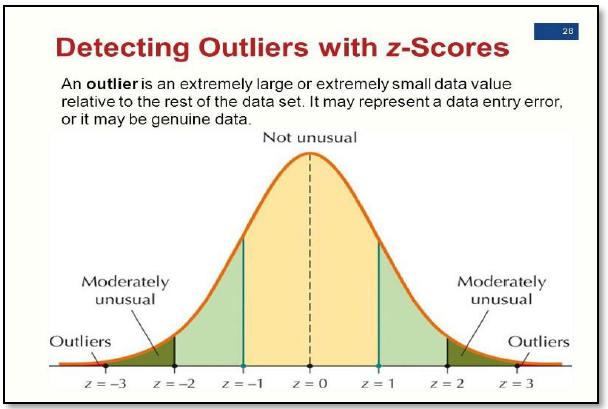
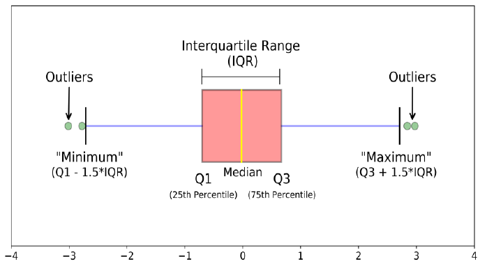
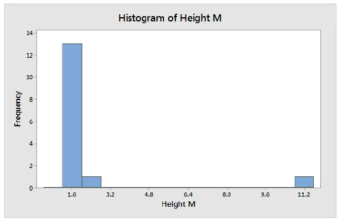
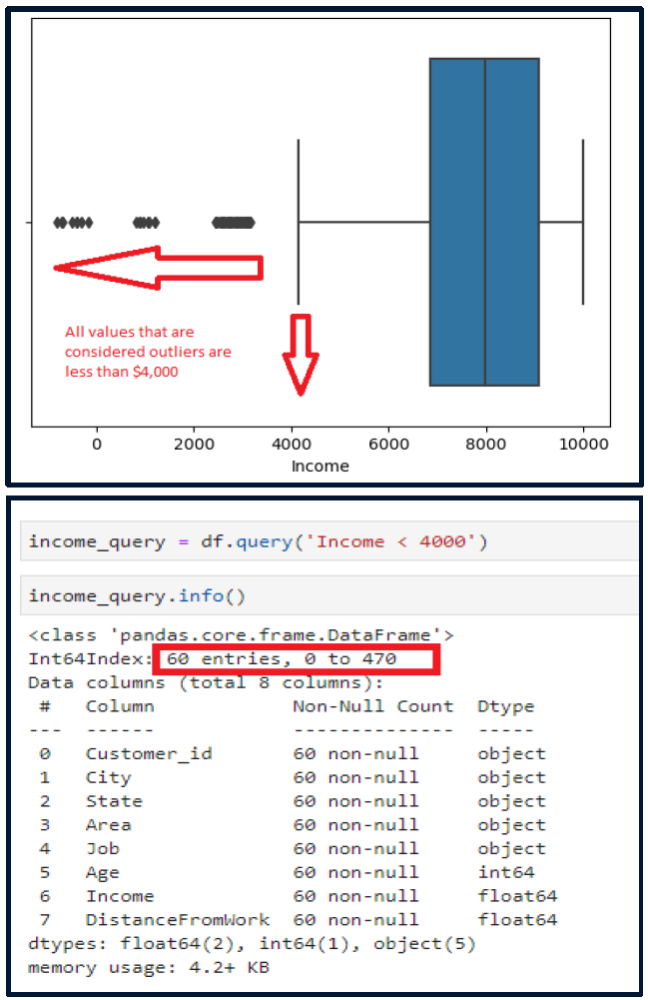
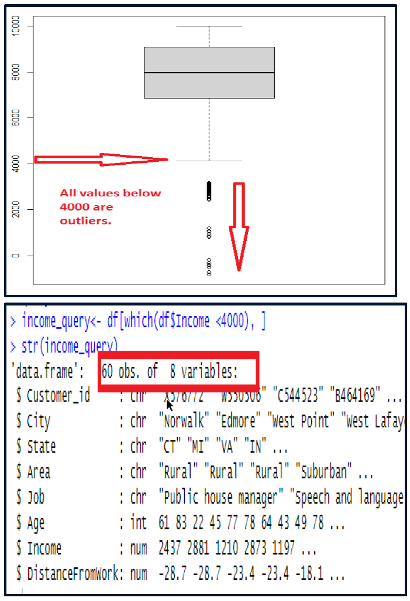

# Outliers

In order for an outlier to exist, there must me some measure of distance between the items.

This is intrinsic to numerical data types.

## Detection Methods

Detection methods include:

* z-scores
* boxplots
* histograms

### Z-Score

The Z-score is a numerical measurement that describes a value's relationship to the mean.

$$
Z = \frac{(x-\mu)}{\sigma}
$$

* $x$ = individual raw data
* $\mu$ = population mean
* $\sigma$ = population standard deviation

The further away an observation’s Z-score is from zero, the more
the more unusual it is.

A standard cut-off value for finding outliers are $Z \pm 3$ or more (if the distribution is normal).

Z-scores tend to be used mainly in the context of the normal curve, and their interpretation based on the standard normal table. However, Z-scores are not limited to distributions that approximate the normal curve.



### Box Plots

Box plots are useful as they provide a visual summary of the data to quickly identify mean values, the dispersion of the data set, signs of skewness, and outliers.

Values that fall outside the two inner fences (minimum and maximum) are outliers.



### Histograms

A histogram is the most used graph to show frequency distributions.

Histograms emphasize the existence of outliers. Look for isolated bars.

Are good for identifying egregious outliers (those that are well outside the typical).



### Computing Z-scores in Python

```python
import numpy as np
import pandas as pd
import scipy.stats as stats
import matplotlib.pyplot as plt

# calculate the z-score for a variable
test_data['Income_z'] = stats.zscore(test_data['Income'])

# display the values and z-score
test_data[['Income', 'Income_z']].head()

# create a histogram to identify outliers
test_data.hist(['Income_z'])
plt.show()
```

### Computing Z-scores in R

```r
# calculate the z-score
test_data$Income_z <- scale(test_data$Income)

# display the z-scores
head(test_data$Income_z)

# create a histogram to identify outliers
test_data %>%
    ggplot(aes(Income_z)) %>%
    geom_histogram()
```

### Computing Box Plots in Python

```python
import seaborn

boxplot = seaborn.boxplot(x = 'Income', data = test_data)
```

### Computing Box Plots in R

```r
test_data %>%
    ggplot(aes(Income)) %>%
    geom_boxplot()
```

## Treating Outliers

There are two fundamental questions you need to answer before you attempt to treat any outliers:

1. Determine the range of the values of the outliers. Are they acceptable or are they outside of a reasonable range of values? Sometimes there are expected outliers that can reasonably be "good" data.
2. Determine the number (or count) of outliers in your data set.

### Answering These Questions in Python

A box plot is a good place to state to see where the outliers are and if they are indeed too extreme to be valid.

```python
income_query = test_data.query('Income < 4000)

income_query.info()
```


### Answering These Questions in R

Again, start with a box plot.

```r
income_query <- test_data[which(test_data$Income < 4000), ]

str(income_query)
```



### Methods of Treating Outliers

1. Imputation - replace outlies with statistical values
    * Used when the values and counts are not acceptable or expected
    * Pros: preserve the sample size
    * Cons: provides guesstimates that could cause bias
2. Retain - keep 'em in the data set
    * Used when values are acceptable or expected (with justification)
    * Pros: preserve the sample size and expected diversity
    * Cons: Decrease normality when using statistical tests
3. Exclude - move outliers to a different data set (different than removal)
    * Used when it is difficult to confirm if the the values are/are not acceptable or expected
    * Pros: Provides flexibility for analysis
    * Cons: Reduction in sample size when the analysis is conducted
4. Remove - drop rows containing outlier(s)
    * Used only when **ALL** other treatment options are mor feasible or when many values within the observation are erroneous
    * Pros: May improve accuracy of analysis
    * Cons: Reduction in sample size may cause limited generalizations

You can use different methods for different variables in the data set.

### Treatment of Outliers in Python

```python
## imputation
# replace outliers with NaN
df['Income'] = np.where(df['Income'] < 4000, np.nan, df['Income'])
df.info()  # see how many NANs there are
# impute with the median
df['Income'].fillna(df['Income'].median(), inplace=True)
df.info()  # see how many NANs remain (should be zero)


## exclude outliers
# create a new dataframe with the outliers
outliers = df[ (df['Income'] < 4000) ]
outliers.info()  # see how many outliers there are
# drop outliers from the "main" dataframe
df.drop(df[ (df['Income'] < 4000) ].index, inplace=True)

## drop outliers
# drop outliers from the dataframe (no saving)
df.drop(df[ (df['Income'] < 4000) ].index, inplace=True)
```

### Treatment of Outliers in R

```r
## imputation
# replace outliers with NA
df$Income[df$Income <= 4000] <- NA
colSums(is.na(df))  # see how many NAs there are
# impute with the median
df$Income[is.na(df$Income)] <- median(df$Income, na.rm=TRUE)
colSums(is.na(df))  # see how many NAs remain (should be zero)

## exclude outliers
# create a new dataframe with the outliers
outliers <- df[which(df$Income < 4000), ]
str(outliers)  # see how many outliers there are
# drop outliers from the "main" dataframe
df <- df[ !(df$Income < 4000), ]

## drop outliers
# drop outliers from the dataframe (no saving)
df <- df[ !(df$Income < 4000), ]
```
