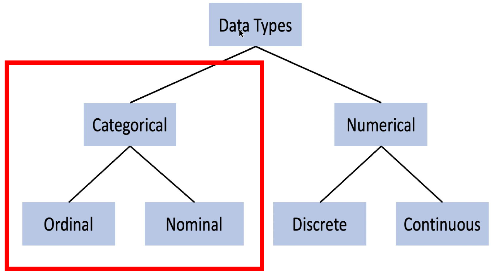

# Re-Expression of Categorical Variables

Topics:

* Data cleaning vs. Data Wrangling
* Method 1: Ordinal Encoding
* Method 2: Label Encoding
* Method 3: One-Hot Encoding

## Data cleaning vs. Data Wrangling

**Data cleaning** focuses on removing missing values and inaccuracies from the data set. This may include outliers.

**Data wrangling** focuses on transforming the data's format, typically by converting "raw" data into another more suitable format.

**Data cleaning** enhances the data's accuracy and integrity while **data wranging** prepares the data structurally for modeling.

*Is data wrangling important for the Performance Assessment even though it's not a data cleaning activity?*

If variables are inconsistent in their expression (i.e., some variables contain *Yes/No* and others *0/1*'s), you must correct them.

### What is Categorical Data?

*Categorical data*  It is a type of [qualitative data](https://www.questionpro.com/blog/qualitative-data/) that can be grouped into categories instead of being measured numerically.

Categorical variables express things like gender, hometown, etc. Categorical measurements are given in natural language descriptions, not numerical values.

You can use numbers to represent categorical data, for example, *1 = Yes* and *0 = No* but those numbers mean nothing mathematically. If it is not meaningful to take the mean of a variable then that variable is categorical. (Birth dates and zip codes are examples of numerical variables that are categorical.)

There are two types of categorical data: *nominal* and *ordinal*.

*Nominal data* consists of categories that can't be ranked or ordered. Examples include symbols, words, letters, and gender. (Nominal data can be both qualitative and quantitative, however.)

*Ordinal data* on the other hand does have a natural order. Clothing sizes are one example of this type of data (small, medium, and large are not measurable differences [i.e., you cannot subtract medium from large], but they are clearly ordered to show size comparisons). Grades or education level are others.

A given categorical variable can only take from a discrete set of possible values.

Often, categorical data is store as `character` in R or `sting`/`Object` in Python.

[Categorical Data: Definition, Types, Features + Examples](https://www.questionpro.com/blog/categorical-data/)




## Method 1: Ordinal Encoding

Transforms categorical value to numerical value based on rank or ordering.

| Original Encoding | Ordinal Encoding |
|:------------------|:----------------:|
| Poor | 1 |
| Good | 2 |
| Very Good | 3 |
| Excellent | 4 |

Variable with values "Yes/No" or "True/False" can be treated ordinally.

| Original Encoding | Ordinal Encoding |
|:------------------|:----------------:|
| No | 0 |
| Yes | 1 |

### Ordinal Encoding in Python

```python
# determine the number of unique values for the variable
bank_train.education.unique()

# replicate the variables in preparation for replacing its categorical
# values with numeric ones (will store the re-expressed values)
bank_train['education_numeric'] = bank_train['education']

# Crate a dictionary to convert the categorical values to numeric
edu_mapping = {
    "education_numeric": {
        "illiterate" : 0,
        "basic.4y" : 4,
        "basic.6y" : 6,
        "basic.9y" : 9,
        "high.school" : 12,
        "professional.course" : 12,
        "university.degree" : 16,
        "unknown" : np.NaN
    }
}

# use the dict to replace the variable's values
bank_train.replace(edu_mapping, inplace = True)
```

### Ordinal Encoding in R

```python
# determine the number of unique values for the variable
unique(bank_train)

# Crate a dictionary to convert the categorical values to numeric
edu.mapping <- revalue(
    x = bank_train$education,
    replace = c(
        "illiterate" = 0,
        "basic.4y" = 4,
        "basic.6y" = 6,
        "basic.9y" = 9,
        "high.school" = 12,
        "professional.course" = 12,
        "university.degree" = 16,
        "unknown" = NA
    )
)

# use as.numeric to convert them to numbers
bank_train$education <- as.numeric(edu.mapping)
```

## Method 2: Label Encoding

In *label encoding* we replace the categorical value (nominal data) with a numeric value between0 and the number of classes minus 1 based on alphabetical order.

This method is ideal if:

* the number assigned as no statistical implication (which is uncommon because numbers often introduce a relationship)
* The number assigned corresponds to its alphabetical order

| State (Nominal Scale) | State Encoding |
|:----------------------|:--------------:|
| North Carolina | 3 |
| South Carolina | 4 |
| Arkansas | 0 |
| Florida | 1 |
| Utah | 5 |

| Original Encoding | Ordinal Encoding |
|:------------------|:----------------:|
| No | 0 |
| Yes | 1 |

| Original Encoding | Ordinal Encoding |
|:------------------|:----------------:|
| False | 0 |
| True | 1 |

Be careful, if you later plan to use this variable in a regression model, for example, these numbers may imply a statistical inference or significance. Do not use label encoding on a nominal variable in this case.

## Method 3: One-Hot Encoding

* Works well for nominal categorical variables with **few unique values**
* For each category (value) of a feature/variable we create a new column (sometimes called dummy variables)
* The new column contains a binary encoding to denote whether a particular row belongs to this category

| Color |
|:-----:|
| Red |
| Red |
| Yellow |
| Green |
| Yellow |

Becomes

| Red | Yellow | Green |
|:---:|:------:|:-----:|
| 1 | 0 | 0 |
| 1 | 0 | 0 |
| 0 | 1 | 0 |
| 0 | 0 | 1 |
| 0 | 1 | 0 |
